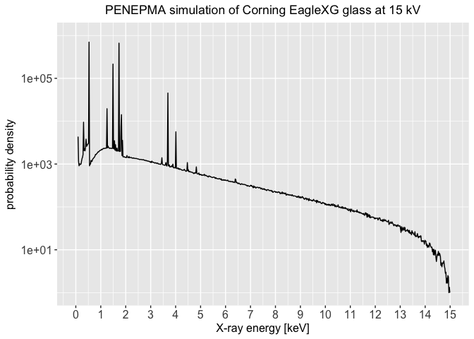

Our objective is to convert an output spectrum from a Monte Carlo
simulation using PENEPMA into a R dataframe for analysis and other
processing.


## Load a spectrum

First we get our exemplar file.


```r
spcPath <- system.file("extdata", "pe-spect-01.dat", package = "rEDS")
spcPath
#> [1] "/Library/Frameworks/R.framework/Versions/3.4/Resources/library/rEDS/extdata/pe-spect-01.dat"
```

Then we create an R dataframe using the `penepmaSpcToDF` function.


```r
library(rEDS)
library(pander)
library(ggplot2)

df <- penepmaSpcToDF(spcPath)
rownames(df) <- c()

pander(head(df))
```


----------------------
 keV     pd      unc  
------ ------- -------
 0.09   4368    690.2 

 0.11   1164    107.2 

 0.13   910.3   57.58 

 0.15   1016    151.6 

 0.17    961    96.13 

 0.19   1002    73.51 
----------------------
and the tail


```r
pander(tail(df))
```


---------------------------------
 &nbsp;     keV     pd      unc  
--------- ------- ------- -------
 **741**   14.89   1.667   1.581 

 **742**   14.91    2.5    1.936 

 **743**   14.93   2.333   1.871 

 **744**   14.95     1     1.225 

 **745**   14.97   1.333   1.414 

 **746**   14.99     1     1.225 
---------------------------------


```r
pander(summary(df))
```


----------------------------------------------------
      keV               pd                unc       
---------------- ----------------- -----------------
 Min.  : 0.090      Min.  : 1.0      Min.  : 1.225  

 1st Qu.: 3.815    1st Qu.: 76.7    1st Qu.: 10.723 

 Median : 7.540   Median : 257.8    Median : 19.759 

  Mean : 7.540     Mean : 2802.8     Mean : 75.231  

 3rd Qu.:11.265   3rd Qu.: 902.8    3rd Qu.: 39.648 

 Max.  :14.990    Max.  :700356.1   Max.  :9636.167 
----------------------------------------------------


Now we are ready to plot the spectrum. There is a very large dynamic
range for both the **probability density** and the **uncertainty**.
Penepma sets a lower limit for data at **1.0e-35**. Missing values are
set to zero. We want to remove values from the dataframe that are
below a useful limit. We do this below and plot a copy of the 
dataframe that is limited to the useful values.


```r
plt <- ggplot(df, aes(x = keV, y = pd)) +
       geom_line() + 
       scale_x_continuous(breaks = seq(from = 0, to = 15, by = 1),
                          limits = c(0,15)) +
       scale_y_log10(limits = c(1.0,1.0e+6)) +
       xlab(label="X-ray energy [keV]") +
       ylab(label="probability density") +
       # (1/(eV*sr*electron)") +
       ggtitle('PENEPMA simulation of Corning EagleXG glass at 15 kV') +
       theme(axis.text=element_text(size=12),
             axis.title=element_text(size=12),
             # center the title
             plot.title = element_text(hjust = 0.5))
       
print(plt)
```

<!-- -->
