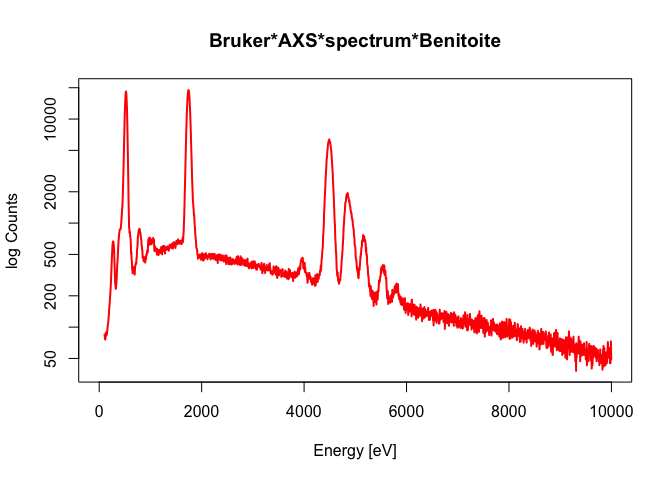
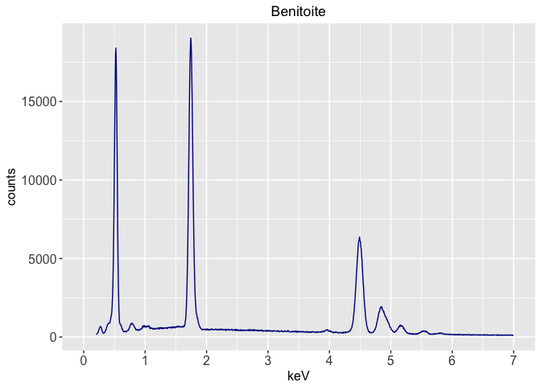
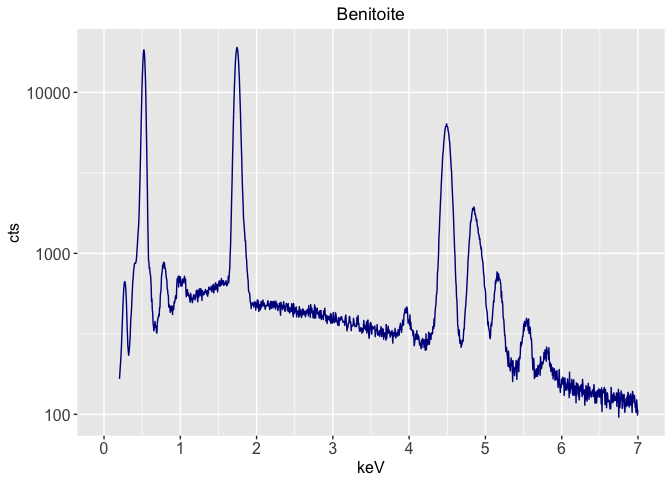

## Load a spectrum

First we get our exemplar **.msa** format spectrum file.


```r
library(rEDS)
#> Loading required package: tcltk
#> Loading required package: rtiff
#> Loading required package: pixmap
#> Loading required package: ggplot2
#> Loading required package: pander
fi <- system.file("extdata", "Benitoite.msa", package = "rEDS")
print(fi)
#> [1] "/Library/Frameworks/R.framework/Versions/3.4/Resources/library/rEDS/extdata/Benitoite.msa"
```

Then we create a Spectrum object using the `SingleMSA` function.


```r
spc <- singleMSA(fi, probecur=2.5)
```

and now we can plot the spectrum.


```r
plot(spc, maxEnergy=10000, doLog=TRUE)
```

<!-- -->

We can also create a ggplot with a linear intensity scale


```r
plt <- ggplotSpectrumLinY(fi, "Benitoite", 0.2, 7.0, 1.0, 2.5)
print(plt)
```

<!-- -->

and with one with a logarithmic intensity


```r
plt <-ggplotSpectrumLogY(fi, "Benitoite", 0.2, 7.0, 1.0, 2.5)
print(plt)
```

<!-- -->
